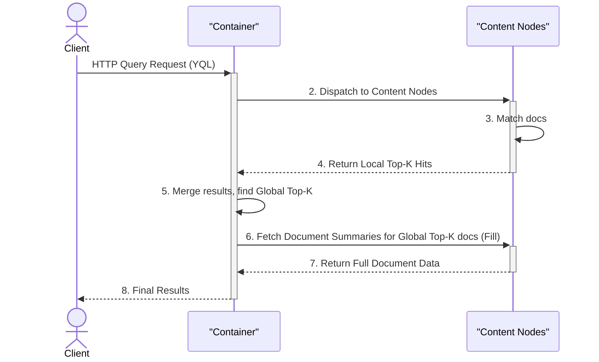
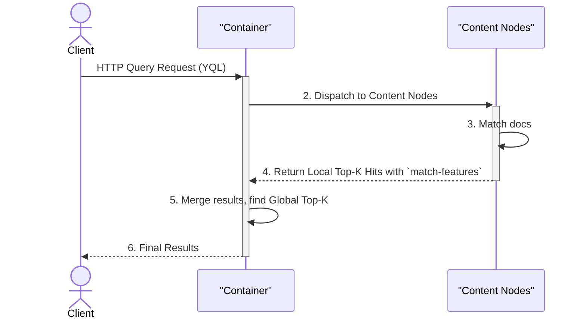

**TL;DR:** be mindful when listing fields in YQL in production!

## Intro

In Vespa, to get data with the hits, you can either specify fields directly in YQL and/or specify a [document summary class](https://docs.vespa.ai/en/learn/glossary.html#document-summary) (DSC)[^dsc].
[Docs](https://docs.vespa.ai/en/querying/document-summaries.html#) advise configuring explicit DSCs for performance [reasons](https://docs.vespa.ai/en/querying/document-summaries.html#selecting-summary-fields-in-yql):
> to optimize performance it is necessary to create custom summary classes.

The remainder of this post discusses when to use which approach and their implications.
We'll touch on the implementation details, version 8.750.13, you've been warned!

[^dsc]: A named set of fields with config on which information they should [contain](https://docs.vespa.ai/en/querying/document-summaries.html#).

## What are we talking about?

[By default, query execution](https://docs.vespa.ai/en/querying/query-api.html#query-execution)[^multiphase] has three phases:
1. Query processing
2. Matching, ranking and grouping/aggregation
3. Result processing, rendering

[^multiphase]: searching can also be thought as [multiphase](https://docs.vespa.ai/en/applications/searchers.html#multiphase-searching).



Here we are interested only in the 3rd phase: [filling](https://docs.vespa.ai/en/querying/query-api.html#result-processing-fill-phase) the document details such as fields, tokens, summary-features, snippets, etc., for the best hits.

### Content Node Summary Cache

To speed up summary fetching, there is an cache for serving document summaries: [Content node summary cache](https://docs.vespa.ai/en/performance/caches-in-vespa.html#content-node-summary-cache).
Conceptually, it is a map from the document ID to a compressed document blob.

For each summary request that can't be fulfilled **entirely** from attribute fields, Vespa checks the cache:
- If the document is in the cache, then the blob is decoded into fields, and the requested fields[^summaryfields] are taken.
- If the document is not in the cache, then the bytes are read from disk, put into cache, and the requested fields are taken.

[^summaryfields]: By the compiled DSC always!

When the DSC contains fields that are `attributes` the cache is not used.
Using only attributes is a recipe for good latencies.

Also, **_ALL_** the document fields are in the summary cache.

If all your document summaries are served from attributes (i.e., no DSC has `from-disk` and no warnings during the deployment), you might want to try disabling this cache to save some memory at the expense of slower filling.

### Special summary classes

Several DSCs are created automatically.

#### The `default` summary class

Any field with `indexing: ... | summary` is included into the `default` summary class.
Also, it includes the [`documentid`](https://docs.vespa.ai/en/reference/schemas/schemas.html#documentid) field which is by default stored in the disk.
Also, `sddocname` is in even though the value is added in the [container node](https://github.com/vespa-engine/vespa/blob/009fd72cd8e6d82d8260c0e5757e573a3905e6d2/container-search/src/main/java/com/yahoo/search/dispatch/rpc/RpcProtobufFillInvoker.java#L328).
Overriding the `default` summary class is limited.

My advice is to avoid adding `summary` to fields indexing and using it in production altogether.

#### The `[all]` summary class

`[all]` is a special DSC that is always present.
It is constructed as a union of all fields from all other available DSC, `default` included.
This class is not mentioned in docs, and it is a fairly recent [addition](https://github.com/vespa-engine/vespa/pull/35267).

### Summary features

Filling a document also means calculating `summaryfeatures` [field](https://docs.vespa.ai/en/reference/schemas/schemas.html#document-summary) 
if the rank-profile has defined any.
If you don't want that, you should add `omit-summary-features` in your DSC: 
```text
document-summary my_class {
    omit-summary-features
    
    summary some_field {}
}
```
This saves CPU if you don't need the computed features.

#### Layered ranking

When a field has `select-elements-by`, then summary fetching involves calculating the summary features that are needed to select parts of the fields to be returned.
For [more](./layered-ranking-gotchas.md).

### Grouping

In the grouping you can get hits in the groups with some summary class prefilled.

## Analysis of the filling machinery

We have two independent parameters that control the filling machinery:
- `presentation.summary` in the query profile
- `select` in YQL.

For the impatient here is the decision table how they should be used:

| `presentation.summary` | `select * from ...` | `select` a _subset_ of the DSC's fields | `select` a _superset_ (fields outside the DSC) |
|---|---|-----------------------------------------|------------------------------------------------|
| **Set** (dedicated DSC) | ✅ | ❌                                      | ❌                                             |
| **Not set** (implicit `default`) | ❌ | ❌                                      | ❌                                             |

✅ a single summary class is fetched, nothing wasted — safe for production.
❌ covers different severities: extra bytes over the wire (subset), a guaranteed `[all]` fallback and disk access (superset), or no per-use-case DSC control (`default`).
Bellow is the case-by-case breakdown for which is which.

### Specifying only the document summary class

When your YQL is `select * from ...`, then
on `.fill(summaryClass)` Vespa sends the request to the content layer and receives only the fields of that particular summary class.
Content nodes fill the summary in the most efficient way possible[^efficient].
All the returned fields are added to the documents in the response.

This should be the shape of the requests against in production.

[^efficient]: either only from attribute, or from summary cache, or from disk.

:::{aside} Summary fallback
When the document has moved from one content node to another during the query execution[^feeding], then the target content node might no longer have the requested document.
Then Vespa falls back to querying all known nodes [for that document](https://github.com/vespa-engine/vespa/blob/009fd72cd8e6d82d8260c0e5757e573a3905e6d2/container-search/src/main/java/com/yahoo/search/dispatch/rpc/RpcProtobufFillInvoker.java#L371).
Here is one more source for tail latencies.
:::

[^feeding]: When the feeding rate is high, that situation is likely to happen. Otherwise, feeding would stall even more, so a query or two can pay the cost of fallback.

### Selecting fields and specifying the document summary class

When a request has both `select field1, ... from ...` and `presentation.summary`, then it is important to understand what happens.
Typically, you don't want to do this.
Let's investigate both cases: a subset or a superset of fields is specified in YQL.

#### Subset

From content nodes all the fields specified in the `presentation.summary` class are fetched.
Then the fields are filtered to the requested fields.
So, a bit more data is transferred over the network than strictly needed, but IMHO nothing too problematic here.

#### Superset

Here is where it gets interesting.
When Vespa detects that the specified summary class can't fulfill the requested fields, then it falls back on fetching the `[all]` special summary class.
Summary `[all]` contains the union of all fields from all other declared summary classes, including the `default`.
So, unless the document is in the summary cache, the disk access is guaranteed.

Also, over time schemas tend to grow in terms of fields (think of the embeddings fields), and the amount of data transferred grows with it. 
Think about the case where you need many documents, but only a few fields.
Then the fallback to `[all]` creates memory allocation spikes.
**You don't want that in production 100%.**

### Selecting fields only in YQL

Then implicitly `default` summary class is used, or if it can't fulfill the requested fields, it falls back to `[all]` summary class.
Note that the list is used as a filter in the [container nodes](https://docs.vespa.ai/en/querying/document-summaries.html#selecting-summary-fields-in-yql) as all fields belonging to the summary class are fetched.

### None is specified

When neither YQL lists fields nor `presentation.summary`, then the `default` summary class is used.
This is typically the situation when you learn Vespa or you are just prototyping.

## Organization dynamics

Say, you have some time to clean up Vespa schemas, and after some investigation you've discovered that several fields are no longer in use for neither matching nor ranking.
You've checked also that it is not part of any named summary.
You've removed the field from the feeding pipeline.
You've then removed the field from the schema.
And all that work was only to hear your QA's complaining that their end-to-end test suite now fails because some fields are missing because they list the fields explicitly in YQL[^organizations].
Now you have either to convince QA to adjust their tests or bring back the field and somehow backfill the field.

[^organizations]: Of course, I'm not saying that allowing to query Vespa directly by multiple teams is a good idea, but organizations are strange and such situations do happen.

But consider if you've required for each use case to define a specific document summary class.
Then you not only would have discovered that the field is in use very early,
but also could even think about enforcing dropping the requests that specify the fields manually.

Also, if your workload needs to fetch all matching documents, and there can be more than 1 M of those, then using only the document summary class can prevent you from the headaches of learning how Vespa memory allocator works[^vespamalloc].
Even though memory allocation is not magic[^magic], but not everyone needs or has time to know the principles and the machinery.

[^vespamalloc]: Did you know that Vespa uses a custom memory [allocator](https://github.com/vespa-engine/vespa/blob/8e2aa211556c1c000b88e6e2b64183a2c433e3e0/vespamalloc/src/vespamalloc/malloc/malloc.h#L12)? And that this memory allocator is also used by [container nodes](https://github.com/vespa-engine/vespa/pull/34439)? I.e., Vespa engineers do a better job than JVM engineers for the specific workload. 

[^magic]: [This video](https://www.youtube.com/watch?v=mYBxnojY-JA) on memory allocation principles is brilliant.

:::{aside} Vespa Malloc
Once memory is allocated because of whatever burst of some workload, the memory is not likely to be reclaimed to the OS until the process exits.
Reclaiming memory would probably mean moving objects around in memory, zeroing, etc., which could cause hiccups in application performance.
This is known as a `[memory high-water mark](https://arxiv.org/pdf/2608.28462)` heuristic: once process needed N bytes, it is likely to need N bytes again.
::: 

### Enforcement of good behavior

To prevent the above anecdotal situation, you could declare the following rules: 

1. Don't allow fields with `summary`, to prevent inflating the `default` summary class.
2. Each use case should have a dedicated document summary class.
3. Wrap `presentation.summary` in dedicated query profiles.
4. Work out with the colleagues to make sure that their requests are using correct query profiles and fields are not specified in YQL.

If the situation is exceptionally bad, then in a custom searcher reject requests of those that didn't get the memo:

```java
if (! query.getPresentation().getSummaryFields().isEmpty()) {
    return new Result(query, ErrorMessage.createBadRequest("""
    Don't specify fields in YQL!
    Use `presentation.summary` and a dedicated document summary class as was agreed.
    """));
}
```

## Since we are here

There is a way to avoid the third query execution phase:
ask only for match-features in the YQL, e.g.
```sql
select matchfeatures from ...
```
This turns query execution into:



There is a nice post on what performance gains this trick [enables](https://vinted.engineering/2025/11/06/vespa-match-features/).
Apart from controlling query execution in your custom searcher chains, there is no way to trigger this behaviour.
I'd go as far as saying that in production it is the only sane usage of listing fields in YQL.

Note that summary fetching typically is at the very end of query execution.
Therefore, this part is most likely to get git by the timeout.
When a node is just after the retry and all caches are empty, the summary fetching latency if it hits the disk is likely to get really high and cause timeouts by itself.

## Conclusion

To sum up, for debugging and prototyping it is OK to specify fields in YQL, but for production use cases use only dedicated DSC either in the request body or in a dedicated [query profile](https://docs.vespa.ai/en/querying/query-profiles.html#).
Allowing fields specified in YQL means problems down the line: either performance and/or maintenance.
The reason for this post to exist is that I had to explain summary filling machinery way too many times already.
