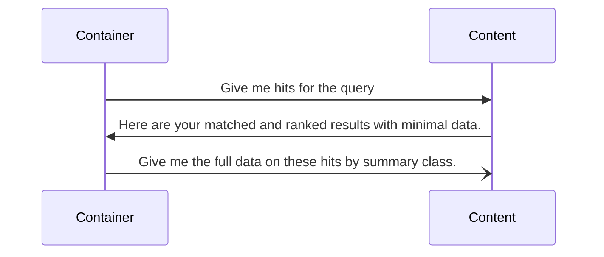

# On Fetching Summary

In Vespa [search execution](https://docs.vespa.ai/en/query-api.html#query-execution) is two phase:

1. Search
2. Fill

In the search phase, match and ranking is done and pushed up the chain with only minimal data about matches.

In the fill phase, the full document details are fetched.

As a diagram:



When container and content nodes are on different machines, this means two network round trips. This means some latency only due to the network.

```{embed} ../notebooks/vespa-ignoring-fill.ipynb#trace-with-summary
:remove-output: false
:remove-input: false
```

There is yet another problem: when data is being redistributed between content nodes,
then summary fetching might fail causing retries.

Now when you feed many documents, redistributions might become constant.

Also, summary fetching uses resources like `docproc` threadpool.

There is yet another trick to get some data about matched documents: [match-features](https://docs.vespa.ai/en/reference/schema-reference.html#match-features).

It allows to get values that can be used in ranking expressions. These expressions are either numbers or tensors. A ranking expression can access values from the document.
This means, that with match-features it is possible to get values from the documents.

And if we can somehow skip the fill phase, then we can eliminate the problems associated with the fill phase and also have our data.


Recently, there was an [addition](https://github.com/vespa-engine/vespa/pull/34029/) to Vespa that should allow to skip the fill phase.

However, when trying this out, I've found out that it does not work.

https://docs.vespa.ai/en/ranking-expressions-features.html#accessing-feature-function-values-in-results

TODO: A design flaw in Vespa when it comes to document IDs.

