**TL:DR**: With BQ, the exact nearest neighbor search might be all you need.

##  Transcript

While all slides are in order, I'll narrate only the slides that are not self-explanatory.

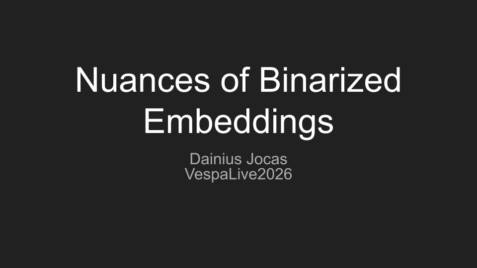

Huge thanks for the organizers for putting this event together!

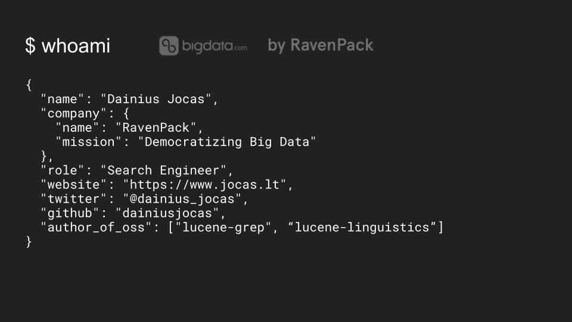

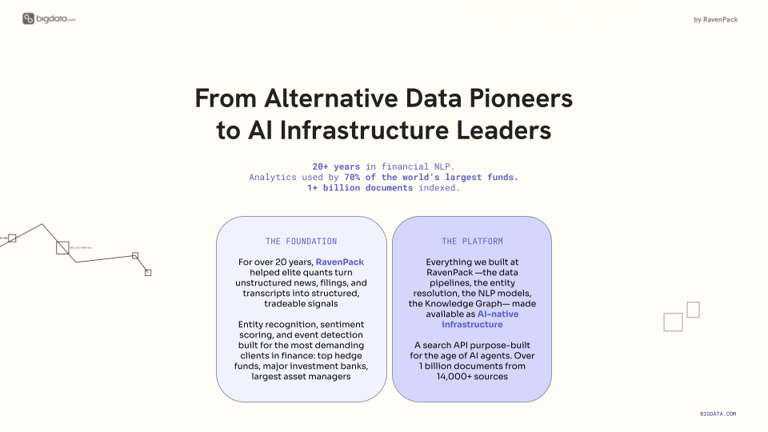

RavenPack started the business more than 20 years ago.
The original thing was to run NLP on financial data and sell it to quants.
Fairly recently the pivot was done to expose that data collection as a search API, i.e., BigData.com.

Inside the platform we have all kinds of data, including news, filings, podcasts, etc. 
If that is your thing, you should definitely check it out!

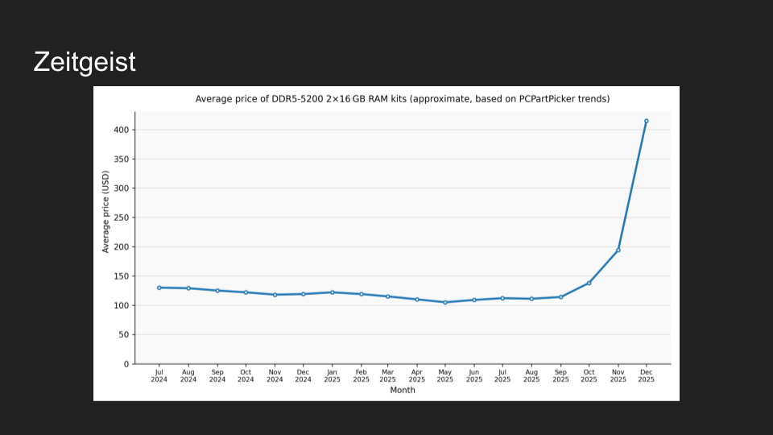

Now onto the main topic.
As you may have noticed, these days everything is getting more expensive.
In the slide we see an explosion of computer memory prices at the end of 2025.

During such times, everyone starts paying attention to the costs.
And it might very well be the case that the search infrastructure with all those fancy embeddings might also have gotten such attention.
Which then was translated into a Jira task titled `Improve economics of the search system` with you assigned.

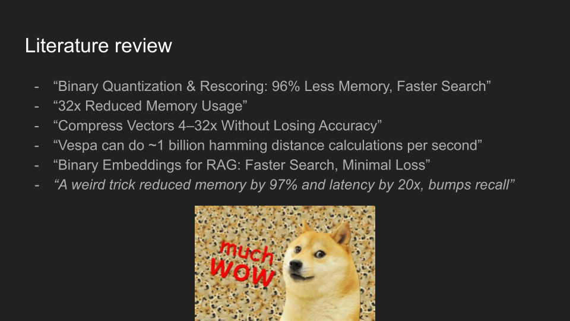

What do you do?
Of course, you go online and search for what people are doing these days.
Pretty quickly you discover this binary quantization (BQ) technique that promises massive reductions in memory usage.

In the slide, only the last title is made up, but it doesn't look too outrageous in this context.

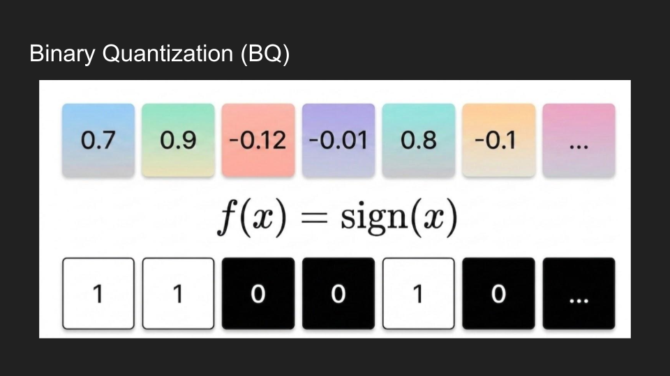

In a typical blog post from a search engine company, you're welcomed by the explanation 
that BQ is a simple function that maps floats to bits.
A high school student can grasp such complex math!

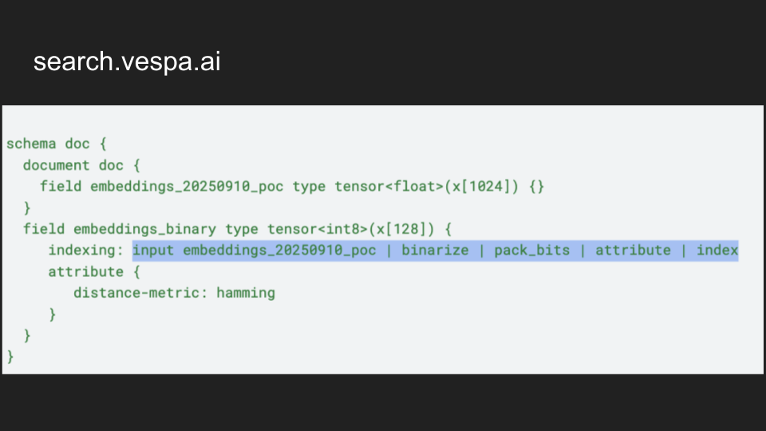

You go to your favourite search engine documentation to check is BQ supported.
In Vespa, the BQ is done by this one-liner.
The full migration is a bit more involved, but it's still fairly straightforward.
                                      

You go back to the blog posts, which typically explain the intuition behind BQ when contrasting black and white images.
Sure, monochrome images have less information, but it is still recognizable.
The migration project looks sellable to the company leadership.

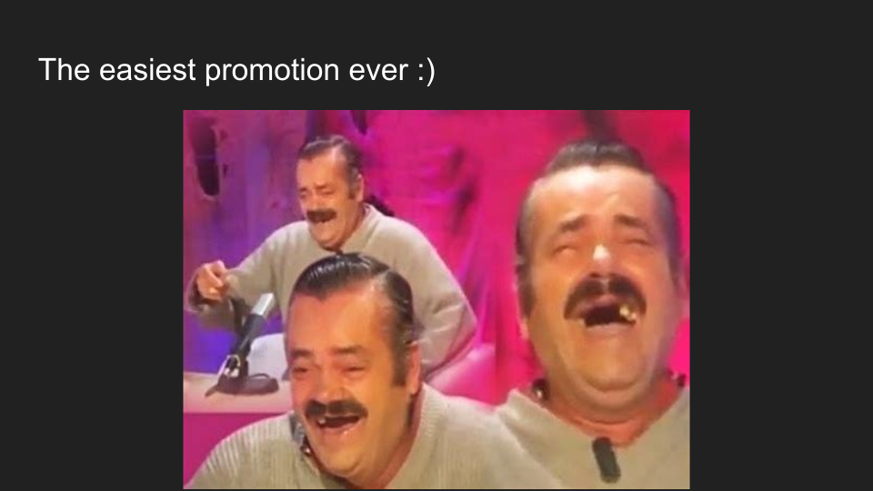

Armed with that understanding, you're thrilled about the bright future that is ahead of you.

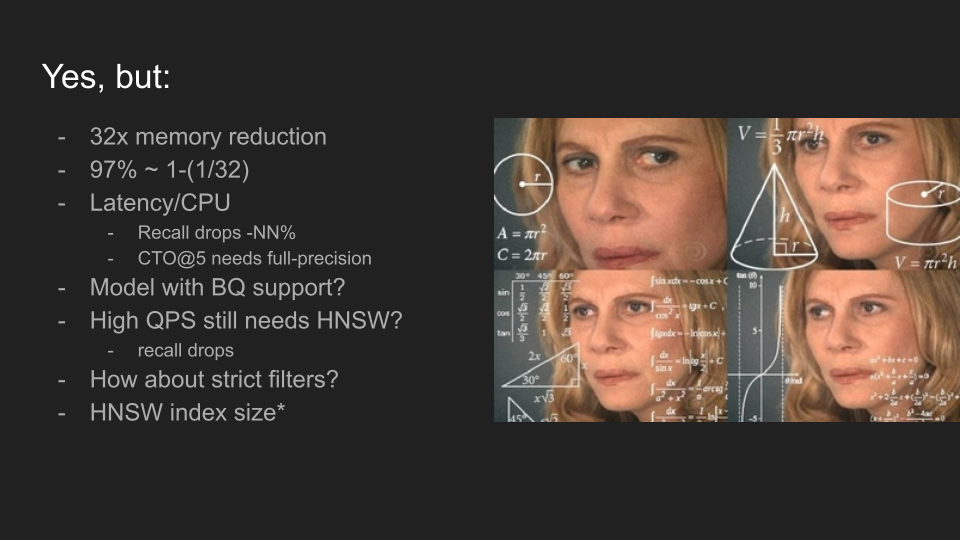

Once the initial dopamine rush is over, you turn on your engineering brains.
You decipher the claims about the memory reduction and saved CPU cycles.
You remember that BQ causes non-trivial recall loss.
But lower recall might not only be a lost sale, it might be a decrease in retention!
Or even a lawsuit from an angry customer.

So, you better preserve some of that recall you've gained by introducing semantic search a couple of promotion cycles ago with the full-precision embeddings.
The current recall is the baseline!

Also, you remember that you have set and tuned HNSW index because otherwise search is slow and peak QPS is pretty low.
But HNSW by itself also decreases recall.
Also, HNSW also has a cost, and we'll take a closer look at it in a second.

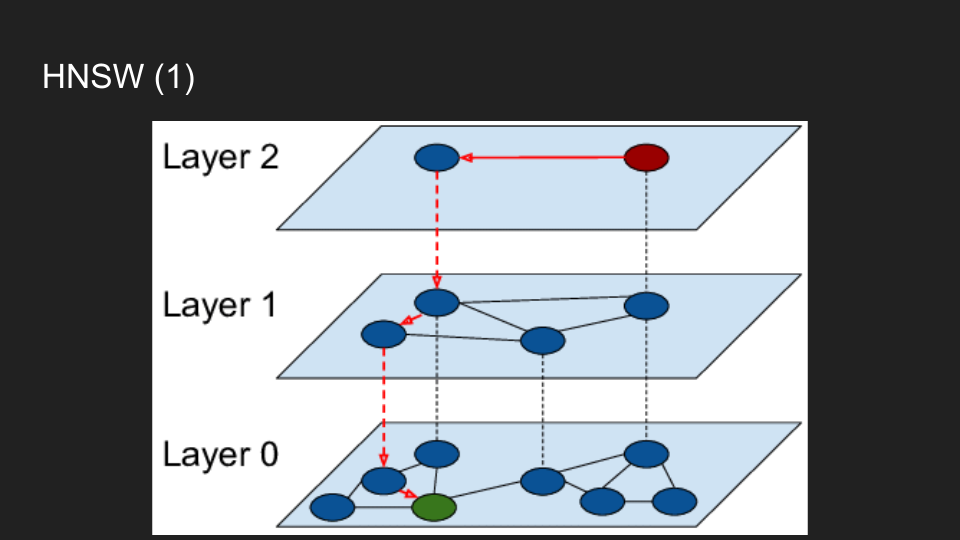

HNSW is a graph data structure that makes your approximate nearest neighbor search (ANN) faster.
In the graph nodes are your embeddings/vectors, edges are document ids, and the graph has several layers.
On the layer-0 all your embeddings live.
Higher layers have exponentially fewer nodes.
                                       
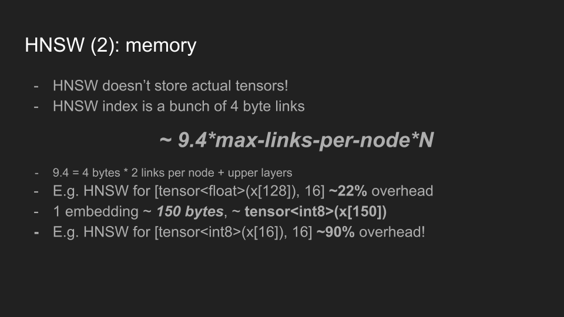
                   
Now the static cost of HNSW in terms of memory usage.
HNSW doesn't store your embeddings, only the edges.
Each edge is four bytes in Vespa.

Which gives that the amount of memory needed is roughly 
$$9.4*max-links-per-node * N$$ bytes.
Where:
- N is the number of embeddings in your index.
- `max-links-per-node` is the number of edges per node.
- 9.4 comes from the fact that at the bottom layer an edge means is points from both directions, i.e., 4 bytes * 2, and some memory needed for higher layers.

E.g. with `tensor<float>(x[128])` and `max-links-per-node=16`, HNSW overhead per node is ~22%, i.e., 16 * 9.4 = 150.4 bytes for and 128 * 4=512 bytes of embeddings, and 150.4 / (512+150.4) ~ 22%.

Which is comparable to storing a `tensor<int8>(x[150])` BQ embedding itself.

What is even more interesting is that HNSW overhead is comparable to storing a `tensor<int8>(x[16])` with `max-links-per-node=16`, HNSW is 90% memory overhead, i.e., 16 * 9.4 = 150.4 bytes for HNSW and 16 bytes for an embedding, and 150.4 / (16+150.4) ~ 90%.

And it is not uncommon that fine-tuned embeddings typically have ~128-256 dimensions.
Which then makes HNSW itself the most expensive component in the search system!

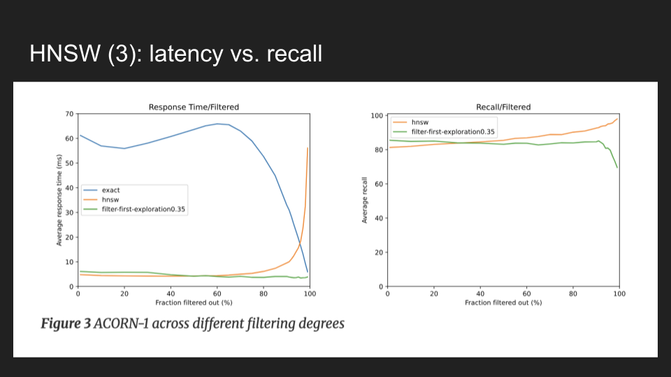

At high filter selectivity, both latency increases (in tandem with CPU utilization) and recall degrades (CTO@5 suffers).
The charts are made from a dataset with 1M embeddings.
With larger HNSW indices, these problems are even more pronounced.

To increase the recall, you typically increase `max-links-per-node` and other HNSW params that both increase memory and CPU utilization.

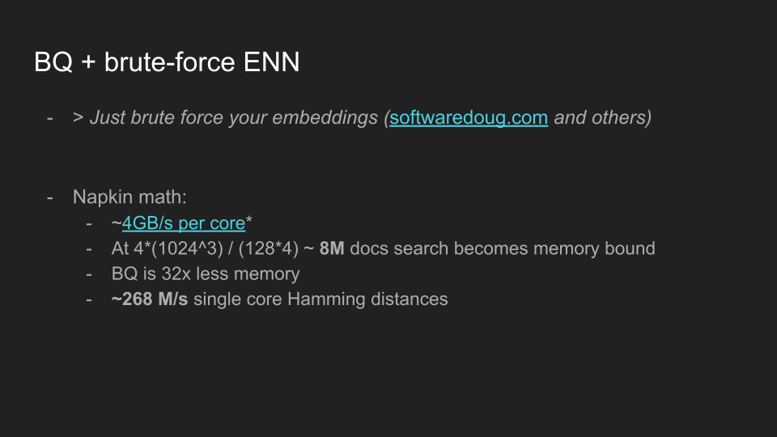

Also, in the context of the vector search, there is little discourse that the exact nearest neighbor search (ENN) might be all you need.

Doing some napkin math:
- a modern CPU core has about 4 GB/s memory bandwidth,
- with our `tensor<float>(x[128])` embeddings it could in theory do about 8M distance computes per second before it gets memory bound.
- BQ promises to reduce memory by 32x

Which when plugged into the equation, gives about 268M Hamming distances computed per core per second.
268M docs in a server is not a small number even these days.

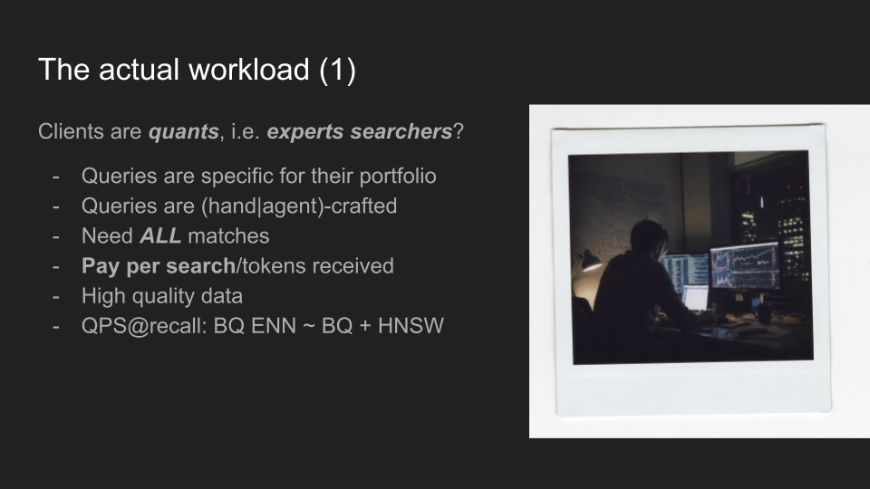

Why am I talking about this?
In my search application the target user is the actual expert searcher, i.e., the quant.
They have their own portfolios to manage, for which they craft/sculpt search queries over time.
Unlike in ecommerce where users are happy when something mathing the query is found, quants want ALL best search matches.
And given that they pay per search or for received tokens, they tend to do fewer but much more complex queries.

For that workload maintaining high recall at some QPS we discovered that BQ ENN is roughly the same as BQ+HNSW.
Which means that HNSW is mostly a memory overhead with not much help of the CPU!

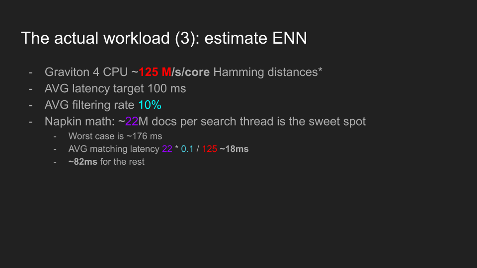

In the experimental setup, a "Graviton 4" CPU does about 125M Hamming distance computes per second per core.
Say that the average filtering ratio is ~90% (i.e., 10% of the documents match the filters), then for a node with 22M docs the worst case latency is about 176 ms, and the average latency is about 18 ms.
And if our average latency target is 100 ms, then this leaves 82 ms for all other matching and ranking operations.

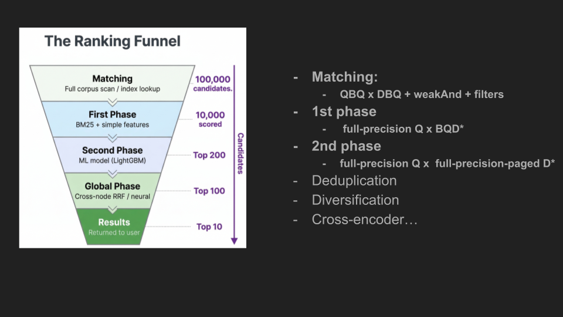

And the matching and ranking funnel for the semantic search aspect is:
- matching is done on BQ query and BQ document embeddings.
- the first-phase scoring is done with a full-precision query against BQ document embedding to increase precision.
- the second-phase scoring is done with a full-precision query against the full-precision paged (i.e., stored on disk instead of memory) document embedding, to fight back that ranking quality.
And the best hits later are deduplicated, diversified, cross-encoded, etc.

That is fairly unusual setup, and we had several unexpected discoveries along the way.

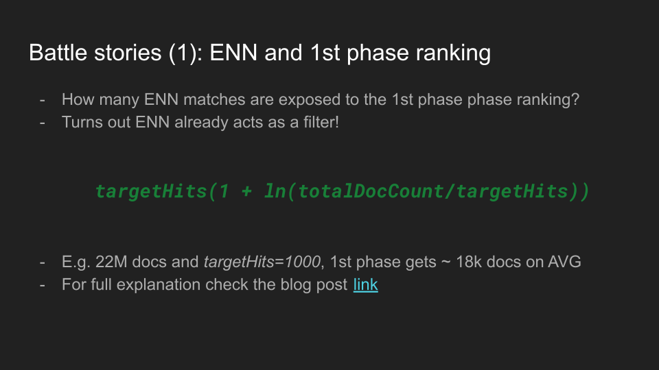

How many ENN matches are exposed to the first phase ranking?
Vespa docs only say that there might be more than `targetHits`.
After digging a bit deeper and setting up some experiments, we've found out that the statistical model is:
$$
targetHits(1 + ln(totalDocCount/targetHits))
$$
E.g., from 22M docs only ~18K docs on average are exposed to the first phase ranking.
The `totalDocCount` is the number of documents the NN was checking, i.e., surviving docs after all other filters.

Read more details [here](./exact-nearest-neighbor-and-target-hits.md).

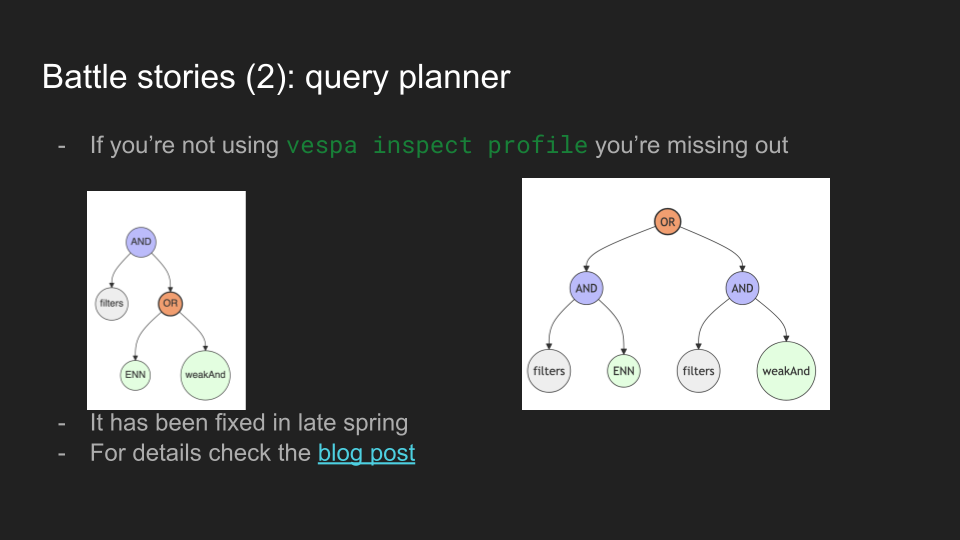

In the benchmarks there were some very slow queries.
It turned out that depending on how YQL was written,
for exactly the same logic,
the execution could be dramatically different.
This has been fixed by the Vespa team in spring 2026.

For details [here](./hybrid-search-enn-weakand.md).

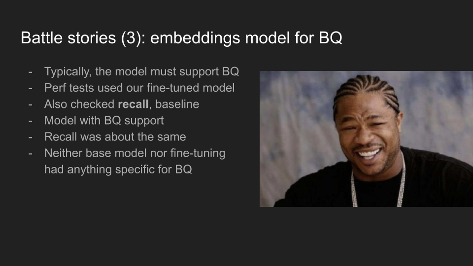

Where we got really lucky is that our fine-tuned embeddings model somehow produces embeddings that even after BQ have a good recall.
Even though neither the base model nor fine-tuning has any specifics about BQ support. 
This saved the costs or reembedding all the documents once again.

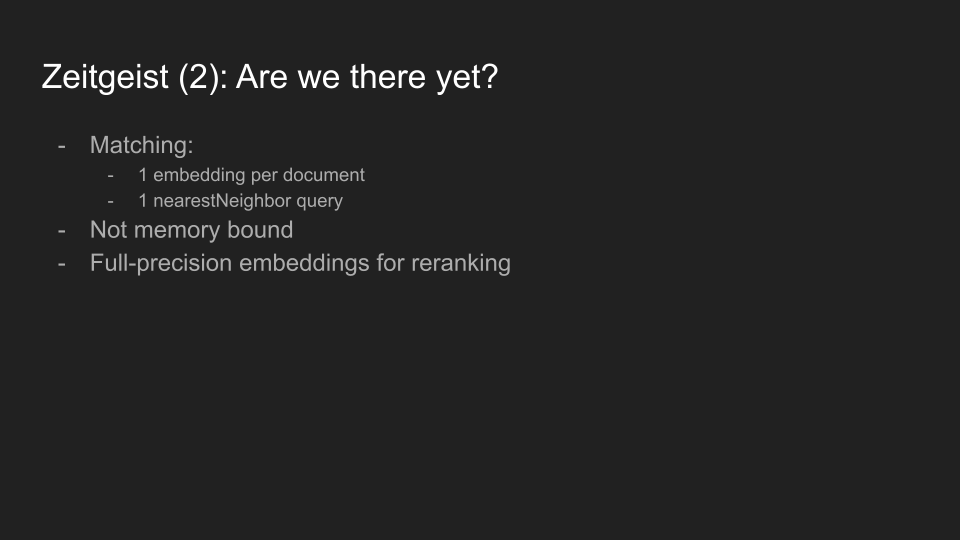

Coming back to the semantic search system costs, are we there yet?
We still have some tricks up the sleeve to improve the economics of our search system. 

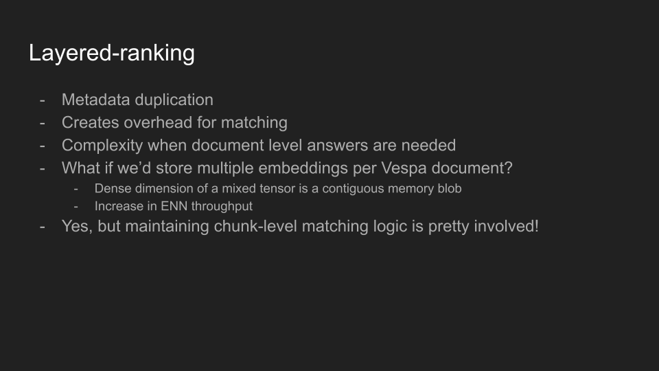

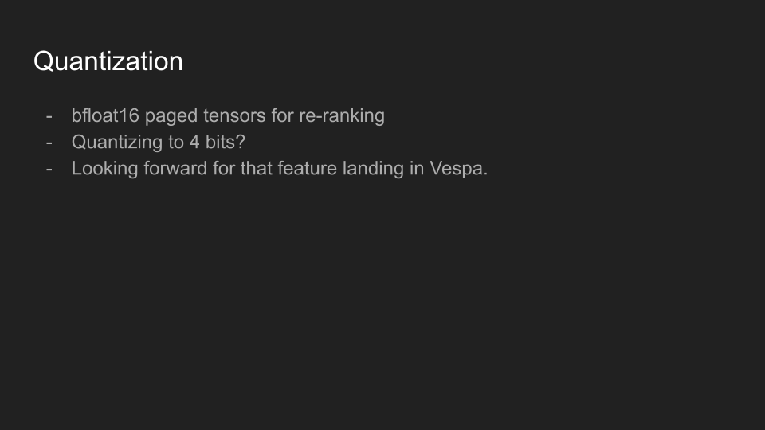

The bfloat16 embeddings are stored in Vespa for reranking.
We can't wait until the native embedding quantization lands in Vespa.
This should reduce bytes read from the disk, and more embeddings could stay paged in memory, making reranking faster.

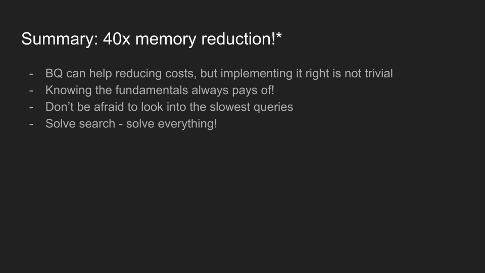

In summary, we've reduced memory by 40x!
32x for actual embeddings and on top removed HNSW.
Of course, not everything is so simple.
But it was a nice project, where we've learned a lot.
Solve search, solve everything.

                                                    
## Full slideshow

<iframe src="https://docs.google.com/presentation/d/e/2PACX-1vSCIYKNbR84cq2VYtQUEH84sjJjYB2Txkc-YZqGvPUUkslrvsMEJK7qYhUfmJ6COxFw8aPNYHWtadTZ/pubembed?start=false&loop=false&delayms=60000" frameborder="0" width="1440" height="839" allowfullscreen="true" mozallowfullscreen="true" webkitallowfullscreen="true"></iframe>
